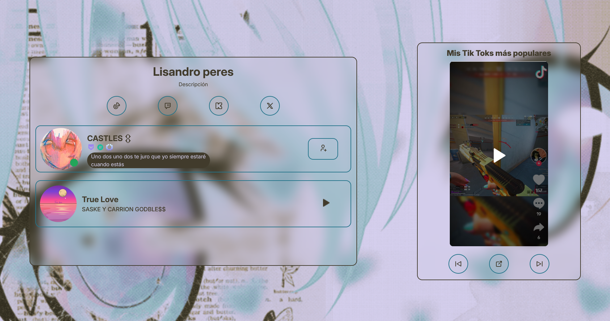

# CasCard

Una tarjeta de presentación y otra con tiktoks (cambiable o borrable), ambas tarjetas tienen efecto 3D. Donde se contiene una música que represente a la persona y su usuario de Discord.

## Vista Previa



## Uso

En caso de desear utilizar o modificar las tarjetas, ingresar estos comandos:

```bash
git clone https://github.com/JunLovin/cascard.git
cd cascard
```

```bash
npm install
npm run dev
```